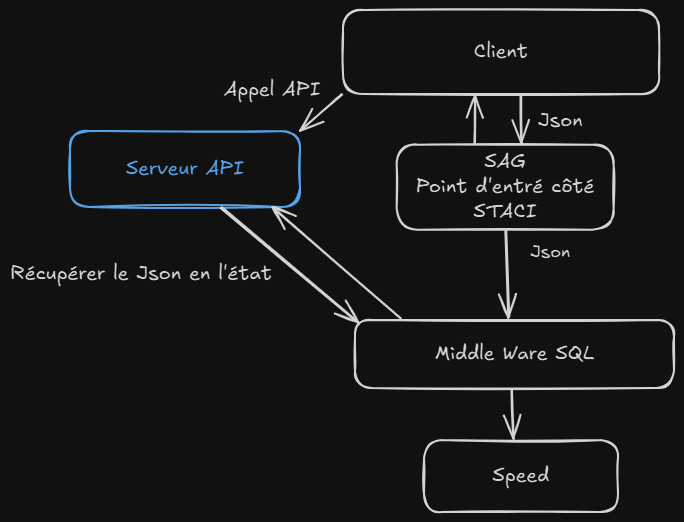

# 📌 Contexte du Projet

## 🏗️ **Projet de développement d'une API en ASP .NET sur une base de données SQL**

### 1️⃣ **Situation Initiale**

Nous avons besoin de développer une API et de la déployer sur un serveur afin de répondre à un besoin client. Ce dernier souhaite avoir un accès centralisé et automatisé à des informations essentielles telles que :

- L'état de son stock
- Les délais de production
- Les niveaux de commandes en cours

---

### 2️⃣ **Objectif du Projet**

L’objectif principal du projet est de réaliser et de mettre en œuvre une API développée en **ASP .NET**, connectée à une base de données **MySQL**. Cette API devra permettre :

✅ La récupération des informations en temps réel via des endpoints REST
✅ L’interaction avec la base de données pour effectuer des requêtes optimisées

---

### 3️⃣ **Outils Utilisés**

Pour assurer le bon développement et la mise en place de l’API, nous avons utilisé les outils suivants :

- **Langage et Framework** : ASP.NET Core Web API
- **Base de données** : MySQL
- **Gestion des requêtes SQL** : ADO.NET (interaction directe avec la base de données)
- **IDE de développement** : Visual Studio Code
- **Serveur d’hébergement** : IIS (Internet Information Services)
- **Outils de test** : Postman, pour le test des endpoints

---

### 4️⃣ **Plan de Mise en Œuvre du Projet**

#### 🚀 **Phase 1 : Documentation et planification**

- 📜 Rédaction de la documentation technique et fonctionnelle
- 📝 Recueil des besoins du client (stock, production, commandes...)

#### 🏗 **Phase 2 : Développement du POC (Proof of Concept)**

- ⚙️ Mise en place d’une API de test sans base de données
- 🔄 Définition des endpoints REST et des réponses simulées
- 🛠 Validation des interactions API avec des données factices
- 🧪 Tests et corrections des fonctionnalités de base

#### 🗄 **Phase 3 : Intégration d’une base de données factice**

- 🏛 Création d’une base MySQL factice pour tester les interactions API
- 🔗 Configuration d’ADO.NET pour la gestion des données
- 💾 Ajout de la persistance des données dans l’API
- ⚡ Validation des requêtes et tests de performances

#### 🔧 **Phase 4 : Développement complet et tests avancés**

- 🔌 Intégration avec la base de données MySQL définitive
- 🔐 Implémentation de la validation des données et des droits d’accès
- 📊 Tests avancés : performances, scalabilité, sécurité
- 📖 Documentation finale en markdown

#### 📦 **Phase 5 : Déploiement et maintenance**

- 🚀 Déploiement de l’API sur un serveur (**IIS**)
- 📈 Mise en place d’un système de logs et monitoring

---

### 🛠️ **Arborescence du Projet**

Voici l’arborescence actuelle du projet et l’utilité de chaque répertoire :

```
POMProject/
├── POM/
│   ├── Controllers/          # Contrôleurs qui gèrent les requêtes API
│   │   ├── ClientsController.cs        # Gestion des clients
│   │   ├── CommandesController.cs      # Gestion des commandes
│   │   ├── ProduitsController.cs       # Gestion des produits
│   │   └── LignesCommandesController.cs # Gestion des lignes de commandes
│   │
│   ├── Data/                 # Gestion des connexions à la base de données
│   │   └── MySqlDatabase.cs           # Classe utilitaire pour les requêtes SQL
│   │
│   ├── Enums/               # Énumérations du projet
│   │   └── DatabaseType.cs            # Types de bases de données supportées
│   │
│   ├── Middleware/          # Middlewares de l'application
│   │   └── ApiKeyMiddleware.cs        # Middleware pour l'authentification par API Key
│   │
│   ├── Models/              # Modèles représentant les entités
│   │   ├── Client.cs
│   │   ├── Commande.cs
│   │   ├── LigneCommande.cs
│   │   └── Produit.cs
│   │
│   ├── Services/            # Services de l'application
│   │   ├── DatabaseService.cs         # Service principal de BDD
│   │   ├── IDatabaseService.cs        # Interface du service de BDD
│   │   ├── IDbOperations.cs          # Interface des opérations de BDD
│   │   ├── MySqlOperations.cs        # Implémentation MySQL
│   │   └── SqlServerOperations.cs    # Implémentation SQL Server
│   │
│   ├── config/              # Fichiers de configuration
│   │   └── database.txt              # Configuration de la base de données
│   │
│   ├── Properties/           # Configuration du projet
│   │   └── launchSettings.json
│   │
│   ├── appsettings.json      # Configuration de l'application
│   └── Program.cs            # Point d'entrée de l'application
│
├── Git-convention.md         # Documentation des conventions Git
├── POM.sln                   # Solution Visual Studio
├── POM.sql                   # Script SQL pour la base de données
├── README.md                 # Documentation principale
└── SchemaProjectPOM.png      # Schéma visuel de l'arborescence
```

---

### 🔗 **Documentation des Endpoints**

#### **ClientsController**

- **GET /api/clients** : Récupérer la liste des clients.
- **POST /api/clients** : Ajouter un nouveau client.
  - **Body** :
    ```json
    {
      "Nom": "John Doe",
      "Email": "john.doe@example.com",
      "Telephone": "123456789"
    }
    ```

#### **CommandesController**

- **GET /api/commandes** : Récupérer la liste des commandes.
- **POST /api/commandes** : Ajouter une nouvelle commande.
  - **Body** :
    ```json
    {
      "ClientId": 1,
      "Total": 150.75
    }
    ```

#### **ProduitsController**

- **GET /api/produits** : Récupérer la liste des produits.
- **POST /api/produits** : Ajouter un nouveau produit.
  - **Body** :
    ```json
    {
      "Nom": "Produit 1",
      "Prix": 50.99,
      "Stock": 100
    }
    ```

#### **LignesCommandesController**

- **GET /api/lignescommandes** : Récupérer les lignes de commandes.
- **POST /api/lignescommandes** : Ajouter une nouvelle ligne de commande.

  - **Body** :

    ```json
    {
      "CommandeId": 1,
      "ProduitId": 2,
      "Quantite": 3,
      "SousTotal": 152.97
    }
    ```

#### **JsonDataController**

- **GET /api/jsondata** : Récupérer toutes les données JSON.
- **GET /api/jsondata/{id}** : Récupérer une donnée JSON spécifique par son ID.
  - **Exemple** : `/api/jsondata/1`
- **POST /api/jsondata** : Enregistrer une nouvelle donnée JSON.
  - **Body** : Un objet JSON valide
    ```json
    {
      "nom": "John Doe",
      "age": 30,
      "ville": "Paris"
    }
    ```
- **GET /api/jsondata/search** : Rechercher dans les données JSON.
  - **Paramètres** : `searchTerm` (chaîne de recherche)
  - **Exemple** : `/api/jsondata/search?searchTerm=John`
- **GET /api/jsondata/between** : Récupérer les données JSON entre deux dates.
  - **Paramètres** :
    - `startDate`: Date de début
    - `endDate`: Date de fin
  - **Exemple** : `/api/jsondata/between?startDate=2024-01-01&endDate=2024-02-28`

---

### 🛠️ **Processus**

Voici le schéma représentant le processus global :



---
